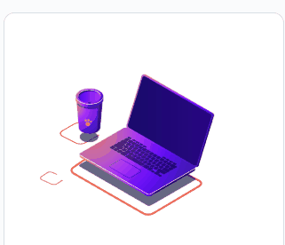

# Exercício HTML + CSS Avançado - App Gerador de conselhos

Exercício de HTML e CSS avançado para praticar o que aprendeu na extensão universitária Dev Full Stack DevEmDobro.
Atualização feita em 01/03/2025. O JavaScript agora consome uma API, do https://api.adviceslip.com/#endpoint-random e gera o conselho automaticamente. 

## Recursos

Este exercício é apenas para demonstrar o que foi aprendido, englobando HTML, CSS e o FlexBox, principal atributo.
A preocupação foi usar de maneira correta a estilização, para termos um layout reponsivo, a visualização do container central é perfeita tanto na visão desktop quando na visão mobile.
Aperte F12 e escolha a visão de celular logo acima na barra de ferramentas do DevTolls e você poderá escolher a marca e modelo do seu aparelho acima para ter uma perfeita previsão da versão mobile.
Essa é a primeira parte trazida de um exercício do Front End Menthor, https://roadmap.sh/projects

→ A segunda parte feita dia 01/03/2025, implementa um document.addEventListener("DOMContentLoaded")... para buscar o click do botão, e os id's do número do conselho, e do conselho em si, para assim, ao click do botão, ser gerado um novo conselho.

## Tecnologias utilizadas

- Construção do site e sistema 
    - HTML;
    - CSS,
    - JavaScript;
    - Consumo de API - https://api.adviceslip.com/#endpoint-random

## Inicialização

Não há necessidade de nennhum npm ao fazer o git.clone.

## Colaboradores

- Exercício de HTML CSS avançado na extensão universitária Full Stack Developer DevEmDobro https://www.instagram.com/devemdobro/;
- Levando a sério para me tornar cada dia melhor.  
 https://github.com/IsaiasLourenco 
 https://www.linkedin.com/in/isaias-louren%C3%A7o/

